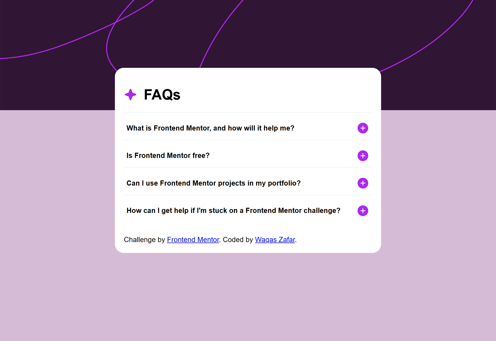

# Frontend Mentor - FAQ accordion solution

This is my solution to the [FAQ accordion challenge on Frontend Mentor](https://www.frontendmentor.io/challenges/faq-accordion-wvPp8aNsz).

## Overview

### Screenshot

 

### Links

- Live Site URL: [https://waqaszafar34.github.io/FAQ-accordion/]
- Solution URL: [https://github.com/your-username/faq-accordion]

## My process

### Built with

- Semantic HTML5 markup
- CSS custom properties
- Flexbox
- JavaScript DOM manipulation

### What I learned

I practiced how to use:
- DOM `querySelectorAll()`, `forEach()`, and `.classList.toggle()`
- Accessibility using button elements and focus states
- Basic accordion toggle logic

### Useful resources

- [MDN Web Docs](https://developer.mozilla.org/) — For JavaScript methods and CSS tips
- [Frontend Mentor Community](https://www.frontendmentor.io/community) — For project inspiration and feedback

## Author

- GitHub – [https://github.com/WaqasZafar34]
- Frontend Mentor – [https://www.frontendmentor.io/profile/WaqasZafar34]

